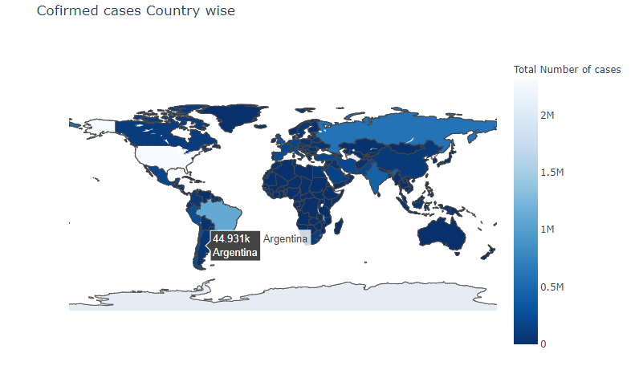

# Covid-19-Dashboard
This is Covid-19 dashboard made by using PyQt5(for GUI creation) and Pandas,Plotly(for data manipulation and data visualization).
This dashboard has 3 sections.

1. You can see the whole wold data by selecting "World" from the dropdown.

Here you can see it in the screenshot,

2. You can see the data for WHO regions just by selecting "WHO-Regions" fom the drop down.

3.You can even see the live data for each country just by selecting "Country Wise" from the dropdown and then you have to write the country's name to get the data,

4. The graphs that are used in this project are made by Plotly so they are also interactive,

Also you can see the graphs in the file named "All Graphs.ipynb."

Thank you for visiting.
